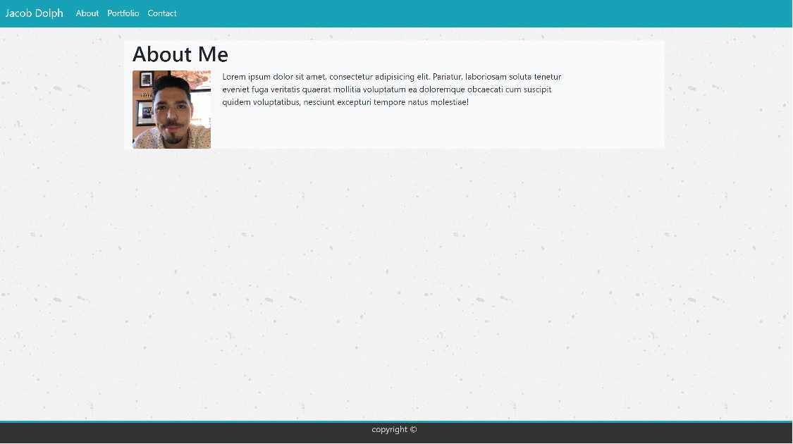
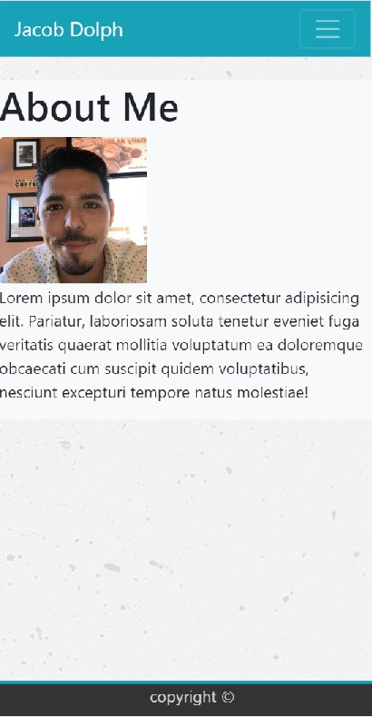

# My Responsive Portfolio

## Overview

This project taught me how to make a portfolio
page responsive from desktop to mobile with bootstrap
using concepts like rows and columns. Having a well
designed responsive website makes it easier for users
to switch between different media (ie desktop, laptop, tablet and mobile)
and have a nice fluid user experience.

## Instructions

Follow the links at the top left corner of the screen for about, portfolio, and contact.
about will give you a brief description of who I am, the portfolio will have a list of projects that I will
be working on. The blue buttons will link to each project. The contact will allow you to communicate with me giving me contact info like your name, email address, and a message.

as the website becomes responsive to mobile devices the navbar turns into a hamburger menu and shifts over to the right of the screen

